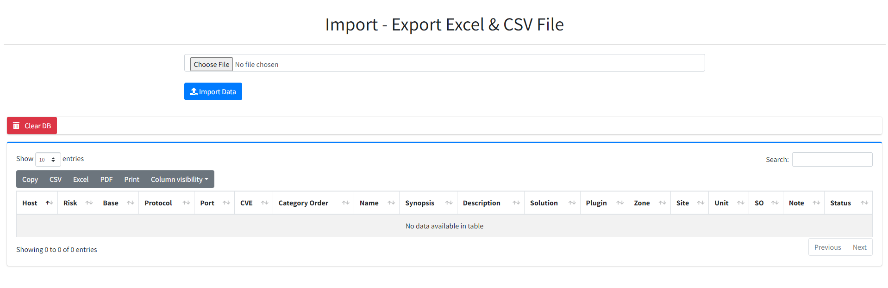

## Import - Export Excel & CSV File

**Author Tuantq**

#### How to clone project

- Clone the repository: __``git clone https://github.com/tqt97/import-excel-to-db-in-laravel``__
- Go to the folder application using cd command on your cmd or terminal __``cd import-excel-to-db-in-laravel``__
- Run __``composer install``__ on your cmd or terminal
- Copy .env.example file to .env on the root folder. You can type __``copy .env.example .env``__ if using command prompt Windows or __``cp .env.example .env``__ if using terminal, Ubuntu
- Open your __.env__ file and change the database name (__DB_DATABASE__) to whatever you have, username (__DB_USERNAME__) and password (__DB_PASSWORD__) field correspond to your configuration.
- Run __``php artisan key:generate``__
- Run __``php artisan migrate:fresh --seed``__
- Run __``npm run dev``__
- Run __``php artisan serve``__
- Go to **http://127.0.0.1:8000**
- You can see the application __running__.

----------------------------------------------------------------
### Aliases in cmd/command
    alias pa='php artisan $1'
    alias pas='php artisan serve'
    alias pam='php artisan make:model $1'
    alias pac='php artisan make:controller $1'
    alias pamm='php artisan make:migration $1'
    alias pamg='php artisan migrate'
    alias pamgfs='php artisan migrate:fresh --seed'
    alias pao='php artisan optimize:clear'
    alias pak='php artisan key:generate'
    alias nrd='npm run dev'
    alias nrb='npm run build'
    alias ci='composer install'
    alias c='composer $1'
    alias envc='cp .env.example .env'
    alias par='php artisan make:request $1'
    alias pammdl='php artisan make:middleware $1'
    alias cl='clear'
    alias pamsrc='php artisan make:resource $1'

## About Laravel

Laravel is a web application framework with expressive, elegant syntax. We believe development must be an enjoyable and creative experience to be truly fulfilling. Laravel takes the pain out of development by easing common tasks used in many web projects, such as:

- [Simple, fast routing engine](https://laravel.com/docs/routing).
- [Powerful dependency injection container](https://laravel.com/docs/container).
- Multiple back-ends for [session](https://laravel.com/docs/session) and [cache](https://laravel.com/docs/cache) storage.
- Expressive, intuitive [database ORM](https://laravel.com/docs/eloquent).
- Database agnostic [schema migrations](https://laravel.com/docs/migrations).
- [Robust background job processing](https://laravel.com/docs/queues).
- [Real-time event broadcasting](https://laravel.com/docs/broadcasting).

Laravel is accessible, powerful, and provides tools required for large, robust applications.
